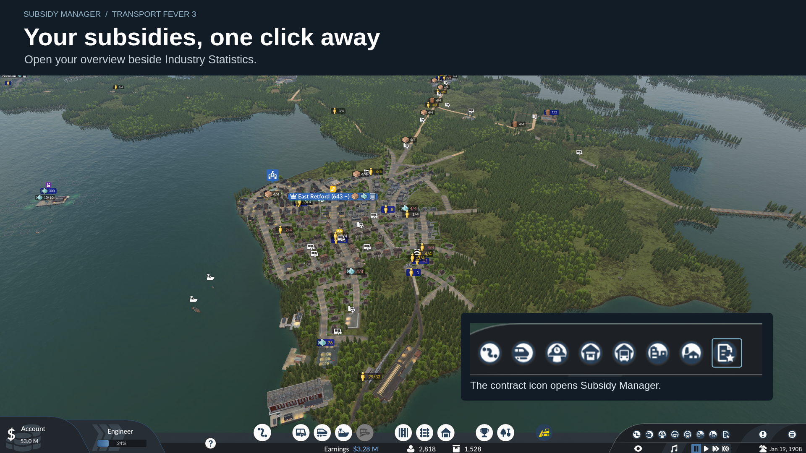
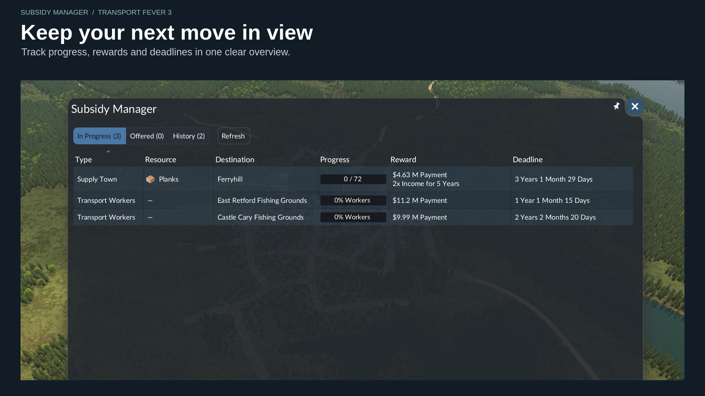
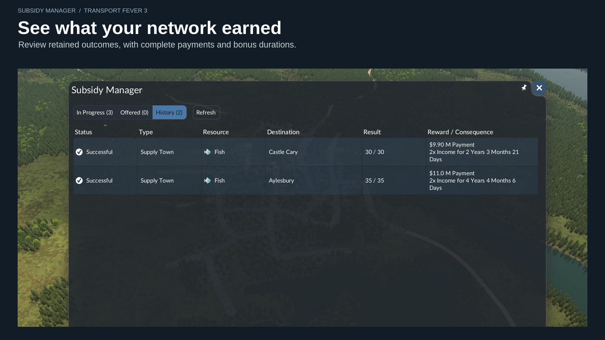
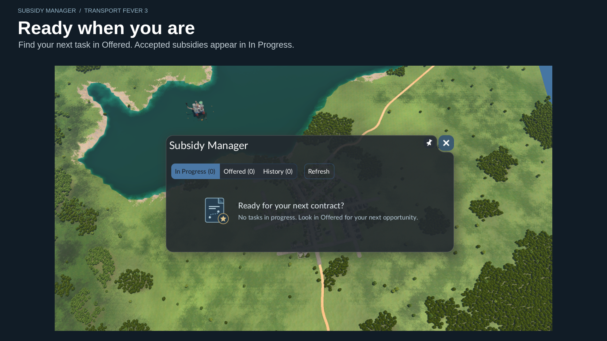
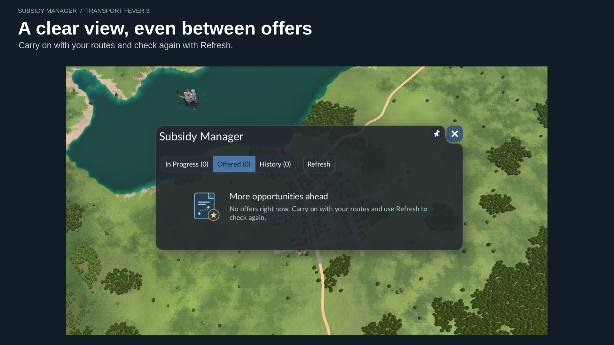
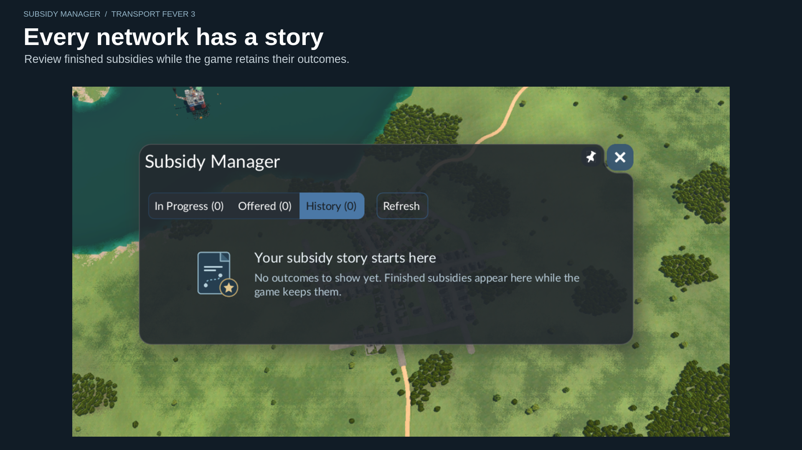

# Subsidy Manager for Transport Fever 3

A useful subsidy offer can be easy to lose in a busy game. Subsidy Manager keeps your opportunities together, so you can spend less time searching through notifications and more time planning your next route.

Compare offers, follow the tasks you've accepted, and see how your subsidies turned out—all from one window beside Industry Statistics.

## What it helps you do

- **Find your next opportunity.** Check the destination, requirements, rewards and remaining time before committing to an offer.
- **Keep your plans on track.** See progress and deadlines for the subsidies you're working on.
- **Read the whole reward.** Payments and bonuses sit on separate lines, with room for longer values and durations.
- **Go straight to the details.** Click a row to open the game's familiar subsidy window, highlight its locations, and accept or decline an offer where available.
- **Review your results.** History brings together successful and failed subsidies while the game retains them.
- **Know when something new arrives.** A small dot on the toolbar icon marks new offers since you last opened the manager.

The mod keeps the game's subsidy rules and rewards as they are. You decide which opportunities suit your network.

## Getting started

**From Mod Hub:** Find **Subsidy Manager**, subscribe, and enable it for your save.

**From a release ZIP:** Extract the `tf3_subsidy_manager_1` folder into the `mods` directory in your TF3 user-data folder, then enable it for your save.

Once your save is loaded:

1. Click the **contract icon** in the bottom-right toolbar, beside Industry Statistics.
2. Choose **Offered** for new contracts, **In Progress** for accepted tasks, or **History** for past outcomes.
3. Click a subsidy to open its details. The game's usual controls handle acceptance and decline.
4. Press **Refresh** whenever you want to bring the overview up to date, including after accepting a subsidy while paused.

You can move and pin the window. When there are no subsidies in any section, it uses a compact layout with a friendly hint. There is no default keyboard shortcut.

## Screenshot gallery

The gallery below uses real game captures. The cover above is promotional artwork.

### Your subsidies, one click away

### Keep your next move in view

### See what your network earned

<strong>A clear view, even when a section is empty</strong>

Each section has its own guidance, with a compact window when the entire overview is empty.

## What's new in v1.1.2

More resilient subsidy reads: when the game's full card helper fails, the manager retries its lightweight helper to retain available progress and rewards. The release ZIP includes the current cover and all six gallery images, checked against their approved sources. See the [changelog](CHANGELOG.md) for the full update.

## A few things to know

- **Refresh is manual.** The toolbar dot checks for new offers; it doesn't refresh the table for you.
- **History is kept by the game.** Older entries can disappear when TF3 removes them.
- **Worker progress is a native workforce boost percentage.** Zero is shown as “0% Workers” when supplied by the game; it is not a cumulative passenger count.
- **Some fields may be unavailable.** Open the game's detail window for the full task information.
- **English is currently the supplied language.**

The mod has been tested in real saves on Linux, including the updated In Progress and History tables and all three compact empty views. Gameplay testing on Windows, macOS, Xbox and PlayStation has not been performed. Mods that change the same toolbar or subsidy interface may conflict.

## Feedback

Found a problem or have an idea? [Open a GitHub issue](https://github.com/Ashcutus/Transport-Fever-3-Subsidy-Tracker/issues). Tell us your mod version, TF3 version and platform, and include a screenshot or error log if it helps explain what happened.

## Credits and licence

Created by **Ashcutus**. Transport Fever 3 is developed by Urban Games; Subsidy Manager is an independent community mod.

Licensed under the [MIT License](LICENSE). You may use, modify and redistribute it under the standard MIT terms.
